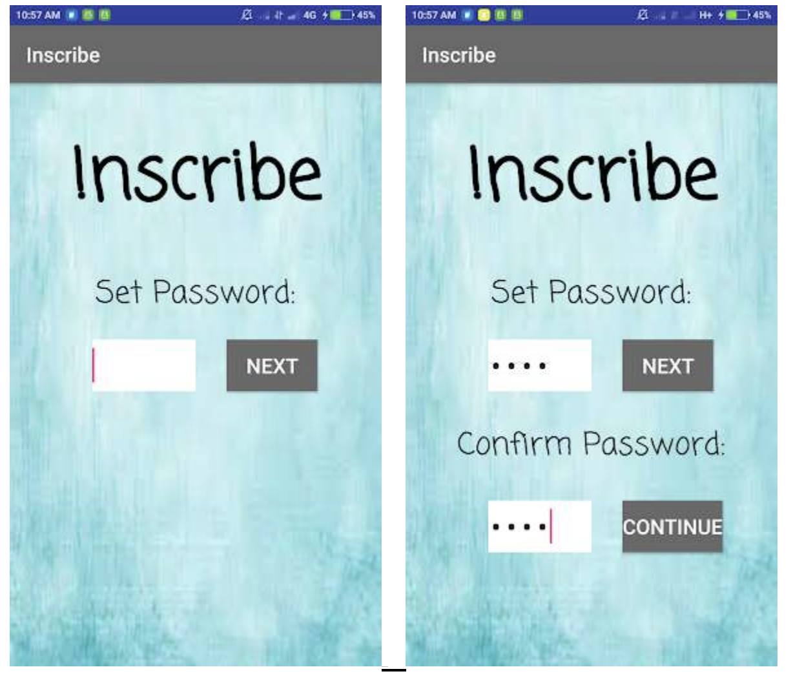
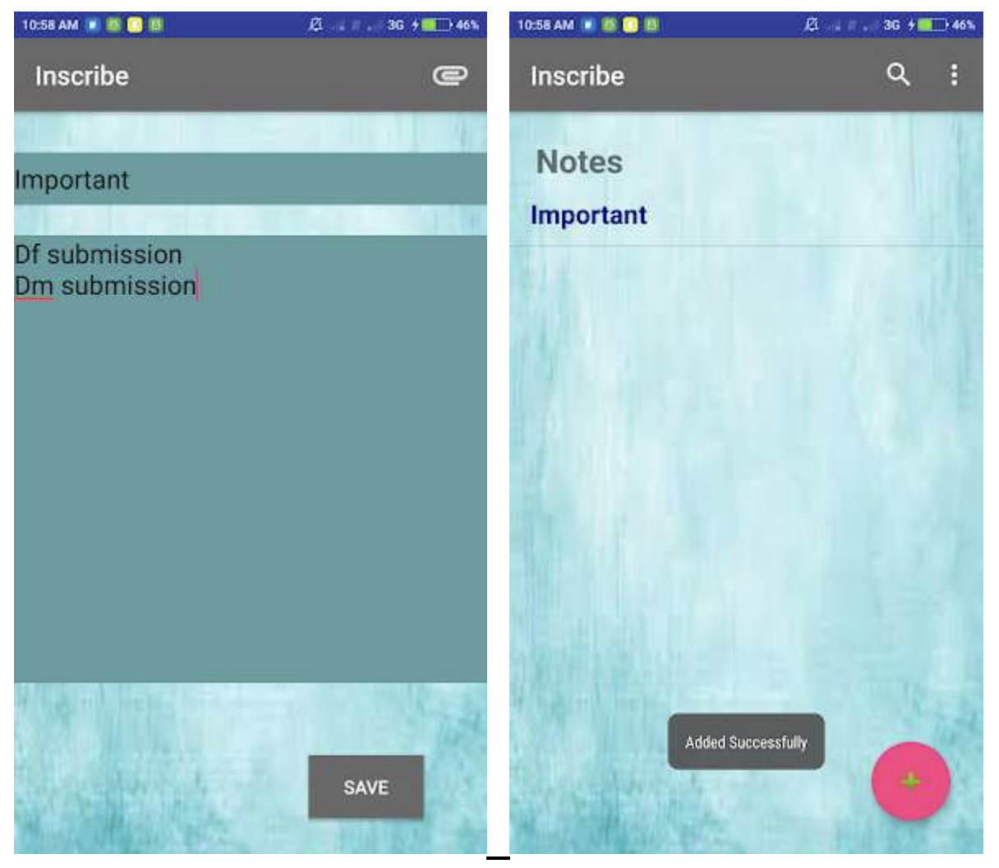
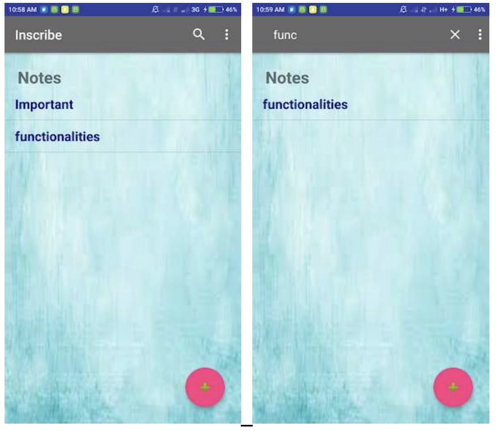

# Inscribe - Note Taking App

## Problem Definition
Inscribe is a versatile note-taking application tailored for users who need a secure platform to store their writings, schedules, and messages for future sharing. It doubles as a secret diary with password protection, ensuring that your notes remain confidential and private.

It is implemented using Android Studio and Sqlite database.

## Key Features
- **Password Protection**: Safeguard your notes with a 4-digit PIN.
- **Manage Notes**: Add, update, and delete your notes with ease.
- **Search Functionality**: Quickly find notes by searching through titles.
- **Share Notes**: Seamlessly share notes with other applications.
- **Password Management**: Conveniently edit your password within the app.

## App Flow
1. **Initial Setup**: Users are prompted to set a 4-digit password upon first installation.
2. **Password Entry**: Access the app by entering the password each time.
3. **Note Display**: View a list of note titles saved previously, with a search option and menu for additional settings.
4. **Adding Notes**: Utilize the floating '+' button to navigate to the 'Add Notes' page to save new entries.
5. **Editing Password**: Change your password by first verifying the old one through the 'Edit Password' option.
6. **Share Notes**: Select a note to view, update, delete, or share its contents with the appended message 'Note from Inscribe!'.
7. **Input Validation**: All fields are validated to ensure the integrity of the data entered.

## Screenshots
Here are some snapshots of the app in action:

1. **First Time Login**  
   

2. **Every Login**  
   

3. **Add Notes**  
   

4. **Search Notes**  
   

5. **Share Note**  
   

---

Crafted with ❤️ by Roshni Soni
